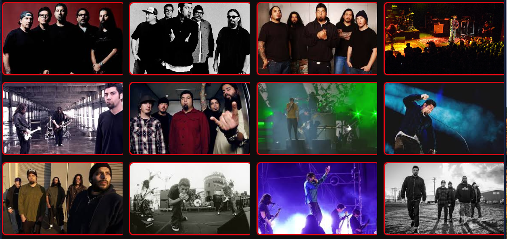

# Fanpage Deftones 🎸

Uma fanpage dedicada à banda **Deftones**, criada como projeto de estudo em HTML, CSS e GitHub Pages.

## 🚀 Funcionalidades
- Galeria com 12 fotos da banda (com legendas e efeitos de hover).
- Seção de **Shows** com vídeos de apresentações ao vivo.
- Seção de **Clipes** com vídeos oficiais.
- Seção de **Discografia** com links para ouvir os álbuns completos no Spotify.
- Layout responsivo e estilizado com bordas vermelhas e sombras.
- Publicação online via GitHub Pages.

## 🛠️ Tecnologias utilizadas
- HTML5
- CSS3
- Git & GitHub

## 📂 Estrutura do projeto

fanpage-deftones/
│── index.html
│── shows.html
│── clipes.html
│── galeria.html
│── style.css
│── imagens/

## 🌐 Deploy
👉 [Fanpage Deftones no GitHub Pages](https://dyeggomg.github.io/fanpage-deftones)

## 📸 Preview

## ✨ Autor
Desenvolvido por **Diego (dyeggomg)** no DevClub 🚀

